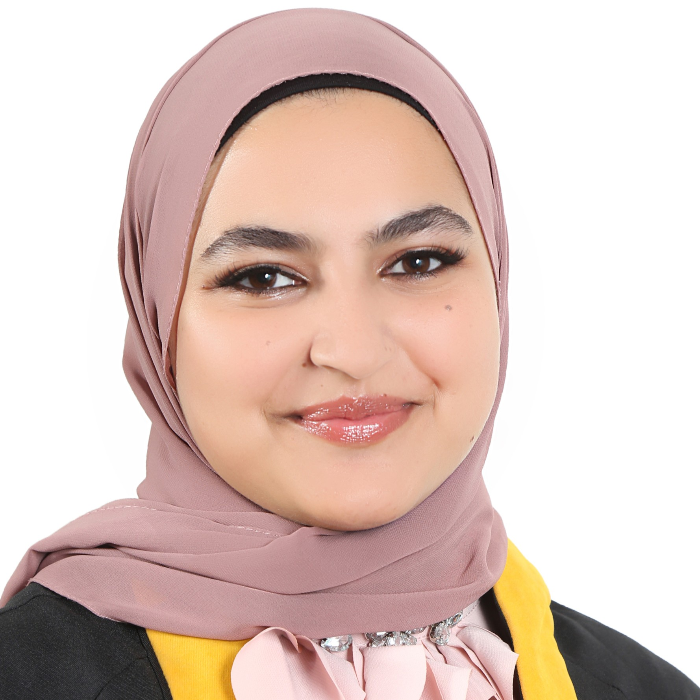

<!DOCTYPE html>
<html lang="en">
<head>
  <meta charset="UTF-8" />
  <meta name="viewport" content="width=device-width, initial-scale=1.0"/>
  <title>Rama's Personal Website</title>
  
</head>
<body>
  <header>
    <h1>Hi, I'm Rama 👋</h1>
    
Aspiring AI Engineer | Web Enthusiast

    
  </header>

  <nav>
    <ul>
      <li><a href="#about">About Me</a></li>
      <li><a href="#projects">Projects</a></li>
      <li><a href="#contact">Contact</a></li>
    </ul>
  </nav>

  <section id="about">
    <h2>About Me</h2>
    

      I am a passionate and driven engineer, proudly holding a degree in Intelligent Systems Engineering from Tafila Technical University. 
      With a strong foundation in problem-solving, creativity, and cutting-edge technologies, I am committed to building innovative solutions that make a real impact. 
      My journey in technology is fueled by curiosity, continuous learning, and the ambition to excel as an AI engineer who delivers excellence in every project.
    

  </section>

  <section id="projects">
    <h2>My Projects</h2>
    

      <a href="Responsive Blog Theme.html" target="_blank" class="tab">Spain Trip Blog</a>
      <a href="Small Business Website.html" target="_blank" class="tab">Spanish Food Menu</a>
      <a href="Traffic Light Exercise.html" target="_blank" class="tab">Traffic Light JS</a>
    

    
Click on a project above to open it in a new tab.

  </section>

  <section id="contact">
    <h2>Contact Me</h2>
    
📧 Email: <a href="mailto:aljufoutrama@gmail.com">aljufoutrama@gmail.com</a>

    
📱 Phone: <a href="tel:+962798033160">+962 7 9803 3160</a>

    
💼 LinkedIn: <a href="http://linkedin.com/in/rama-al-jufout-a93a74322" target="_blank">View my LinkedIn</a>

  </section>

  <footer>
    
&copy; 2025 Rama Ahmad

  </footer>
</body>
</html>
